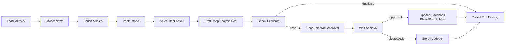

# AI News Agent

LangGraph workflow tu dong tim tin AI moi nhat, cham diem tin co tuong tac/anh huong cao, chon 1 bai tot nhat, viet bai phan tich chuyen sau cho Facebook, kem anh minh hoa neu bai goc co metadata anh, gui qua Telegram de duyet, va co the publish len Facebook Page sau khi approve.

Mac dinh project dung NVIDIA NIM OpenAI-compatible API:

- `LLM_PROVIDER=nvidia`
- `OPENAI_BASE_URL=https://integrate.api.nvidia.com/v1`
- `OPENAI_MODEL=openai/gpt-oss-120b`
- `NVIDIA_API_KEY`

Van co the quay lai OpenAI native bang cach dat `LLM_PROVIDER=openai`, them `OPENAI_API_KEY`, va doi `OPENAI_MODEL`.

## Architecture



## Memory layers

- `LangGraph checkpoint`: luu trang thai execution theo `thread_id`.
- `SQLite domain memory`: luu article fingerprint, post history, Telegram feedback, publish status.
- `Prompt memory`: dua cac post gan day vao prompt de tranh lap goc nhin.

## Duplicate prevention

Workflow chong dang trung lap theo 3 lop:

- URL canonical: cac bai da tung nam trong post history se bi loai truoc khi draft, ke ca khi URL moi co them tracking query nhu `utm_source`.
- Content similarity: sau khi LLM viet nhap, workflow so sanh voi 20 post gan nhat. Neu noi dung qua giong, run duoc luu voi status `skipped_duplicate` va khong gui Telegram/khong publish Facebook.
- Prompt memory: cac post gan day van duoc dua vao prompt de giam lap lai goc nhin va cach dien dat.

## Setup

```bash
python -m venv .venv
.venv\Scripts\activate
pip install -e ".[dev]"
copy .env.example .env
```

Dien toi thieu:

- `NVIDIA_API_KEY`
- `TELEGRAM_BOT_TOKEN`
- `TELEGRAM_APPROVER_CHAT_ID`

## Run once

```bash
ai-news-agent run-once
```

## Run automation

```bash
ai-news-agent daemon
```

`SCHEDULE_CRON` dung cron 5 truong. Vi du `0 8 * * *` chay 8:00 hang ngay theo timezone may chu.

## Admin UI

```bash
ai-news-agent ui
```

Open `http://127.0.0.1:8787`.

The UI supports:

- Set daily posting time, which writes `SCHEDULE_CRON` in `.env`.
- Run the workflow manually.
- Change LLM provider/model/base URL.
- Configure approval timeout, news lookback, max candidates.
- Enable/disable Facebook publishing and update Page settings.
- View current run status and recent post memory.

## Telegram approval

Bot se gui ban nhap kem huong dan:

- Reply `APPROVE` de duyet.
- Reply `REJECT: ly do` de tu choi.
- Reply `EDIT: yeu cau chinh sua` de yeu cau workflow tu revise.

Neu `FACEBOOK_ENABLED=true`, workflow se publish len Facebook Page sau khi `APPROVE`.

## Test

```bash
pytest
ruff check .
```
