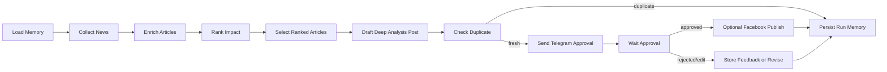

# AI News Agent

An end-to-end Agentic AI workflow that discovers high-impact AI news, ranks relevant articles, writes a deep Facebook analysis post, routes the draft through Telegram approval, prevents duplicate publishing, and optionally publishes to a Facebook Page.

Vietnamese documentation: [README_VI.md](README_VI.md)

The project is designed as a portfolio-grade Agentic AI system: it is not just a single LLM prompt. It combines workflow orchestration, external tools, memory, human approval, scheduling, UI configuration, and production-oriented safeguards.

## Features

- Multi-step LangGraph workflow.
- AI news collection from RSS, Hacker News, Tavily, and NewsAPI.
- Impact ranking based on recency, engagement, relevance, and novelty.
- Deep Vietnamese Facebook post generation.
- Optional article image metadata extraction for Facebook photo posts.
- Telegram approval workflow with `APPROVE`, `REJECT`, and `EDIT` commands.
- Auto-approval after a configurable timeout.
- Optional Facebook Page publishing through the Facebook Graph API.
- SQLite memory for article fingerprints, post history, feedback, and audit logs.
- Duplicate prevention by canonical URL and content similarity.
- Admin UI for running the workflow, scheduling posts, updating configuration, and viewing history.
- Test suite and linting setup.

## Default LLM Provider

The default configuration uses NVIDIA NIM through an OpenAI-compatible API:

- `LLM_PROVIDER=nvidia`
- `OPENAI_BASE_URL=https://integrate.api.nvidia.com/v1`
- `OPENAI_MODEL=openai/gpt-oss-120b`
- `NVIDIA_API_KEY`

You can switch back to OpenAI native mode by setting:

- `LLM_PROVIDER=openai`
- `OPENAI_API_KEY`
- `OPENAI_MODEL`

Note: `openai/gpt-oss-120b` is a text model. It does not generate images directly. The current workflow uses image metadata from source articles when available.

## Architecture



## Memory Layers

- `LangGraph checkpoint`: keeps execution state by `thread_id`.
- `SQLite domain memory`: stores article fingerprints, post history, approval status, Telegram feedback, and Facebook post IDs.
- `Prompt memory`: injects recent posts into the LLM prompt to reduce repeated angles and wording.

## Duplicate Prevention

The workflow prevents duplicate publishing through three layers:

- Canonical URL filtering: previously posted source URLs are filtered before drafting, even when a new URL includes tracking parameters such as `utm_source`.
- Content similarity check: after the LLM creates a draft, the workflow compares it with the 20 most recent posts. If it is too similar, the run is stored as `skipped_duplicate` and the post is not sent to Telegram or Facebook.
- Prompt memory: recent posts are passed into the prompt so the model avoids repeating prior angles.

## Requirements

- Python 3.11+
- Telegram bot token and approver chat ID
- NVIDIA API key or OpenAI API key
- Optional Facebook Page ID and Page Access Token

## Setup

```powershell
python -m venv .venv
.\.venv\Scripts\activate
pip install -e ".[dev]"
copy .env.example .env
```

Fill in at least:

```env
LLM_PROVIDER=nvidia
NVIDIA_API_KEY=
OPENAI_BASE_URL=https://integrate.api.nvidia.com/v1
OPENAI_MODEL=openai/gpt-oss-120b

TELEGRAM_BOT_TOKEN=
TELEGRAM_APPROVER_CHAT_ID=
```

Optional Facebook publishing:

```env
FACEBOOK_ENABLED=true
FACEBOOK_PAGE_ID=
FACEBOOK_PAGE_ACCESS_TOKEN=
```

## Run Once

```powershell
ai-news-agent run-once
```

This runs the full workflow once:

1. Collect AI news.
2. Enrich article metadata.
3. Rank impact.
4. Select articles after ranking.
5. Write a Facebook draft.
6. Check duplicates.
7. Send to Telegram for approval.
8. Publish to Facebook if enabled and approved.
9. Persist memory.

## Run the Admin UI

```powershell
ai-news-agent ui
```

Open:

```text
http://127.0.0.1:8787
```

The UI supports:

- Manual workflow runs.
- Daily posting schedule.
- LLM provider/model/base URL configuration.
- News lookback, candidate count, and selected article count.
- Telegram approval timeout and auto-approval.
- Facebook Page publishing settings.
- Light/dark mode and theme color.
- Run status and recent post memory.

## Run Automation

```powershell
ai-news-agent daemon
```

`SCHEDULE_CRON` uses a standard 5-field cron expression. Example:

```env
SCHEDULE_CRON=25 3 * * *
```

This runs every day at 03:25 according to the machine timezone.

Important: the scheduler only runs while the UI or daemon process is alive. For production, run it with a service manager such as Windows Task Scheduler, systemd, Docker, or a cloud worker.

## Telegram Approval

The bot sends a draft with instructions. Reply to the Telegram message with:

- `APPROVE` to approve and continue.
- `REJECT: reason` to reject and store feedback.
- `EDIT: requested changes` to ask the workflow to revise the draft.

If auto-approval is enabled and the timeout expires, the workflow treats the draft as approved.

## Testing

```powershell
pytest
ruff check .
```

Current coverage focuses on:

- LLM response parsing.
- Scoring logic.
- Telegram approval parsing.
- Telegram timeout behavior.
- Memory and duplicate prevention.

## Key Files

- `src/ai_news_agent/workflow.py`: LangGraph workflow.
- `src/ai_news_agent/news.py`: news collection, enrichment, ranking.
- `src/ai_news_agent/llm.py`: LLM post writer and revision logic.
- `src/ai_news_agent/memory.py`: SQLite memory and duplicate checks.
- `src/ai_news_agent/telegram.py`: Telegram approval client.
- `src/ai_news_agent/facebook.py`: Facebook Page publisher.
- `src/ai_news_agent/ui.py`: FastAPI admin UI.
- `AGENTIC_AI_PORTFOLIO_REPORT.md`: detailed Vietnamese portfolio report.
- `README_PORTFOLIO.md`: English portfolio overview.

## Security Notes

- Do not commit `.env`.
- `.env.example` intentionally contains empty secret values.
- Rotate Facebook Page tokens regularly.
- Use least-privilege API credentials.
- Keep approval enabled for sensitive or public-facing publishing workflows.
