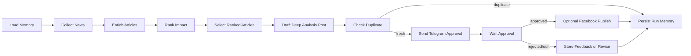

# AI News Agent

Một workflow Agentic AI end-to-end để tự động tìm tin tức AI có ảnh hưởng cao, xếp hạng bài viết, viết bài phân tích chuyên sâu cho Facebook, gửi bản nháp qua Telegram để duyệt, chống đăng trùng, và có thể tự động đăng lên Facebook Page.

Dự án này được thiết kế như một sản phẩm Agentic AI cấp portfolio: không chỉ là một prompt gọi LLM, mà là một hệ thống có workflow, tool integration, memory, approval gate, scheduler, UI cấu hình và các cơ chế bảo vệ khi vận hành.

## Tính năng chính

- Workflow nhiều bước bằng LangGraph.
- Thu thập tin AI từ RSS, Hacker News, Tavily và NewsAPI.
- Xếp hạng bài viết theo độ mới, tương tác, độ liên quan và độ mới so với memory.
- Viết bài phân tích Facebook bằng tiếng Việt.
- Lấy ảnh minh họa từ metadata bài gốc nếu có.
- Gửi bản nháp qua Telegram để duyệt.
- Hỗ trợ lệnh `APPROVE`, `REJECT`, `EDIT`.
- Tự động approve sau thời gian timeout nếu được bật.
- Có thể publish lên Facebook Page bằng Facebook Graph API.
- SQLite memory để lưu article fingerprint, lịch sử post, feedback và audit log.
- Chống đăng trùng bằng canonical URL và so sánh độ giống nội dung.
- Admin UI để chạy workflow, đặt lịch, đổi cấu hình và xem lịch sử.
- Có test suite và linting.

## Nhà cung cấp LLM mặc định

Mặc định project dùng NVIDIA NIM qua OpenAI-compatible API:

- `LLM_PROVIDER=nvidia`
- `OPENAI_BASE_URL=https://integrate.api.nvidia.com/v1`
- `OPENAI_MODEL=openai/gpt-oss-120b`
- `NVIDIA_API_KEY`

Có thể chuyển sang OpenAI native bằng cách cấu hình:

- `LLM_PROVIDER=openai`
- `OPENAI_API_KEY`
- `OPENAI_MODEL`

Lưu ý: `openai/gpt-oss-120b` là model text, không tạo ảnh trực tiếp. Hiện tại workflow dùng ảnh từ metadata bài viết gốc nếu có.

## Kiến trúc



## Các lớp memory

- `LangGraph checkpoint`: lưu trạng thái execution theo `thread_id`.
- `SQLite domain memory`: lưu article fingerprint, post history, approval status, Telegram feedback và Facebook post ID.
- `Prompt memory`: đưa các post gần đây vào prompt để giảm lặp lại góc nhìn và cách diễn đạt.

## Cơ chế chống đăng trùng

Workflow chống đăng trùng theo 3 lớp:

- Canonical URL filtering: bài đã từng đăng sẽ bị loại trước khi draft, kể cả khi URL mới có thêm tracking parameter như `utm_source`.
- Content similarity check: sau khi LLM viết draft, workflow so sánh với 20 post gần nhất. Nếu quá giống, run được lưu là `skipped_duplicate` và không gửi Telegram/Facebook.
- Prompt memory: các post gần đây được đưa vào prompt để model tránh lặp lại cùng một góc nhìn.

## Yêu cầu

- Python 3.11+
- Telegram bot token và approver chat ID
- NVIDIA API key hoặc OpenAI API key
- Facebook Page ID và Page Access Token nếu muốn tự động đăng Facebook

## Cài đặt

```powershell
python -m venv .venv
.\.venv\Scripts\activate
pip install -e ".[dev]"
copy .env.example .env
```

Điền tối thiểu:

```env
LLM_PROVIDER=nvidia
NVIDIA_API_KEY=
OPENAI_BASE_URL=https://integrate.api.nvidia.com/v1
OPENAI_MODEL=openai/gpt-oss-120b

TELEGRAM_BOT_TOKEN=
TELEGRAM_APPROVER_CHAT_ID=
```

Nếu muốn publish Facebook:

```env
FACEBOOK_ENABLED=true
FACEBOOK_PAGE_ID=
FACEBOOK_PAGE_ACCESS_TOKEN=
```

## Chạy một lần

```powershell
ai-news-agent run-once
```

Lệnh này sẽ chạy toàn bộ workflow:

1. Thu thập tin AI.
2. Enrich metadata bài viết.
3. Xếp hạng mức độ ảnh hưởng.
4. Chọn bài sau khi rank.
5. Viết draft Facebook.
6. Kiểm tra trùng lặp.
7. Gửi Telegram để duyệt.
8. Publish Facebook nếu được bật và approved.
9. Lưu memory.

## Chạy Admin UI

```powershell
ai-news-agent ui
```

Mở:

```text
http://127.0.0.1:8787
```

UI hỗ trợ:

- Chạy workflow thủ công.
- Đặt giờ đăng bài hằng ngày.
- Cấu hình LLM provider, model và base URL.
- Cấu hình lookback, số lượng candidate, số bài sau ranking.
- Cấu hình Telegram approval timeout và auto approve.
- Cấu hình Facebook Page publishing.
- Chọn light/dark mode và theme color.
- Xem trạng thái run và lịch sử post.

## Chạy automation

```powershell
ai-news-agent daemon
```

`SCHEDULE_CRON` dùng cron expression 5 trường. Ví dụ:

```env
SCHEDULE_CRON=25 3 * * *
```

Nghĩa là chạy mỗi ngày lúc 03:25 theo timezone của máy đang chạy.

Lưu ý: scheduler chỉ chạy khi process UI hoặc daemon còn sống. Nếu đóng terminal/process thì automation sẽ dừng. Khi production nên dùng Windows Task Scheduler, systemd, Docker hoặc cloud worker.

## Telegram approval

Bot sẽ gửi bản nháp kèm hướng dẫn. Reply vào message bằng:

- `APPROVE` để duyệt.
- `REJECT: lý do` để từ chối và lưu feedback.
- `EDIT: yêu cầu chỉnh sửa` để yêu cầu workflow revise.

Nếu auto-approval được bật và hết thời gian timeout, workflow sẽ coi draft là approved.

## Test

```powershell
pytest
ruff check .
```

Test hiện tập trung vào:

- Parse output LLM.
- Logic scoring.
- Parse lệnh Telegram approval.
- Timeout và auto approve Telegram.
- Memory và duplicate prevention.

## File quan trọng

- `src/ai_news_agent/workflow.py`: LangGraph workflow.
- `src/ai_news_agent/news.py`: thu thập, enrich và rank tin tức.
- `src/ai_news_agent/llm.py`: viết và revise post bằng LLM.
- `src/ai_news_agent/memory.py`: SQLite memory và duplicate checks.
- `src/ai_news_agent/telegram.py`: Telegram approval client.
- `src/ai_news_agent/facebook.py`: Facebook Page publisher.
- `src/ai_news_agent/ui.py`: FastAPI admin UI.
- `AGENTIC_AI_PORTFOLIO_REPORT.md`: report portfolio tiếng Việt chi tiết.
- `README_PORTFOLIO.md`: portfolio overview tiếng Anh.

## Lưu ý bảo mật

- Không commit `.env`.
- `.env.example` cố ý để trống các giá trị secret.
- Nên rotate Facebook Page token định kỳ.
- Dùng API credential với quyền tối thiểu.
- Nên giữ approval gate cho các workflow publish nội dung công khai hoặc nhạy cảm.
